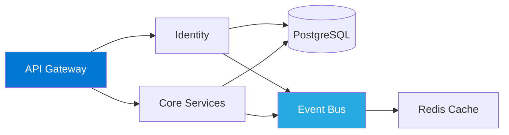

<div align="center">


# Vinícius Oliveira


[](https://www.linkedin.com/in/vinniciusolliveiracostaa/)
[](mailto:vinniciusolliveiracostaa@outlook.com)

</div>

---

## About

Specialized in designing and building **distributed systems** and **event-driven architectures** for high-scale SaaS platforms. Focus on architectural decisions that balance technical excellence with business pragmatism.

**Core Expertise:**
- Multi-tenant architecture design
- Event-driven systems (NATS, Kafka)
- Zero Trust security implementation
- High-throughput data pipelines

---

## Technical Stack

<div align="center">

### ⚛️ Core Languages


</div>

<div align="center">

### 🔄 Technology Carousel


</div>

<div align="center">

### 🛠️ Complete Toolset

<details>
<summary><b>View all technologies and tools</b></summary>

<br>

**Backend Frameworks**
```
Fastify • NestJS • Gin • Elysia
```

**Frontend Frameworks**
```
Next.js • SolidJS • Yew
```

**Databases & ORMs**
```
PostgreSQL • Redis • GORM • TypeORM • Prisma • Drizzle
```

**Message Brokers**
```
NATS • Apache Kafka
```

**Authentication & Authorization**
```
Zitadel • Keycloak • CASL • Casbin • Oso
```

**Infrastructure & DevOps**
```
Docker • Linux • AWS • WireGuard • GitHub Actions • Nginx
```

**Runtimes & Tools**
```
Node.js • Bun • Vite • Shell Script
```

**Styling**
```
TailwindCSS • HTML • CSS
```

</details>

</div>

---

## Architecture Principles

<table>
<tr>
<td width="50%">

```yaml
design:
  - Domain-Driven Design
  - Clean Architecture
  - Event Sourcing
  - CQRS Pattern
```

</td>
<td width="50%">

```yaml
approach:
  - Architecture First
  - Explicit Trade-offs
  - Boring Technology
  - Operational Excellence
```

</td>
</tr>
</table>

---

## Selected Work

<details>
<summary><b>Multi-Tenant SaaS Platform</b></summary>

<br>

Enterprise governance platform with 7 integrated products under unified identity layer.

**Architecture:**


**Key Decisions:**
- Modular monolith → microservices evolution path
- NATS JetStream for event orchestration
- PostgreSQL with tenant isolation
- ABAC authorization with dynamic policies

**Metrics:** `p95 < 200ms` | `1000 req/s` | `99.5% uptime`

</details>

<details>
<summary><b>High-Throughput Data Pipeline</b></summary>

<br>

CSV processing system handling 100k+ rows with zero data loss.

**Architecture:**
```
CSV Stream → Chunk Processor → Deduplication (SHA-256)
     ↓              ↓                    ↓
Validation → Worker Pool (5) → PostgreSQL (Batch)
     ↓              ↓                    ↓
Error Queue → Kafka Events → Progress Tracking
```

**Key Features:**
- Streaming ingestion with backpressure
- Atomic deduplication using content hashing
- Transactional outbox pattern
- Automatic retry with exponential backoff

</details>

---

## GitHub Activity

<div align="center">


</div>

<div align="center">


</div>

---

## Contact

For architecture consulting or technical leadership opportunities:

<div align="center">

[](https://www.linkedin.com/in/vinniciusolliveiracostaa/)
[](mailto:vinniciusolliveiracostaa@outlook.com)

</div>

---

<div align="center">


</div>
